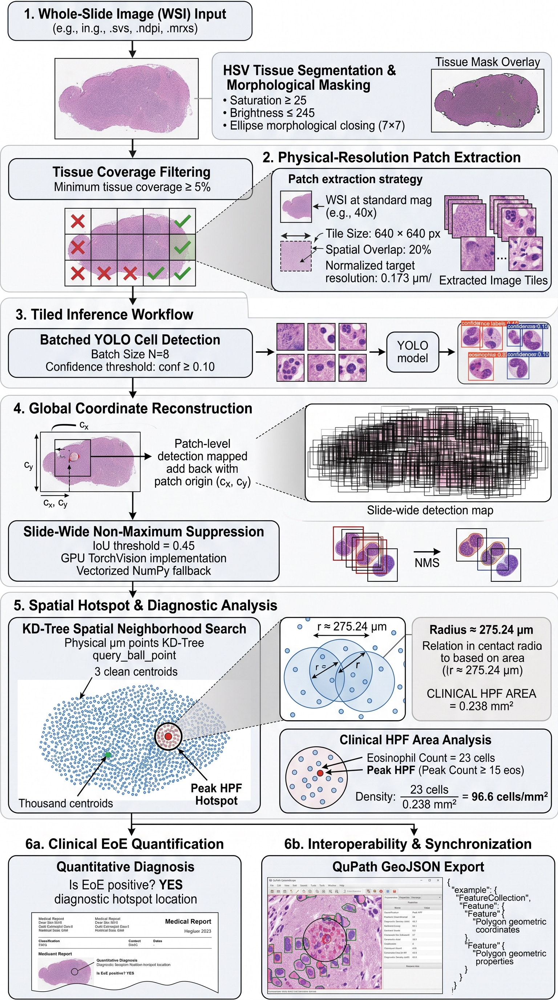

# EsophaScope

[](https://www.python.org/downloads/)
[](https://wiki.qt.io/Qt_for_Python)
[](https://github.com/ultralytics/ultralytics)
[](https://openslide.org/)
[](LICENSE)

**EsophaScope** is a high-throughput digital pathology workstation for whole-slide image (WSI) screening of esophageal biopsies. It automates eosinophil localization, calculates diagnostic High-Power Field (HPF) peak cell densities for Eosinophilic Esophagitis (EoE) staging ($\ge 15\text{ eos/HPF}$), and supports bidirectional synchronization with QuPath GeoJSON annotations.

---

## Architecture & Processing Pipeline



_Diagram generated by Gemini 3.8Flash._

---

## Core Capabilities

- **Zero-Thrash Pyramidal Canvas**: Streams multi-resolution gigapixel slides using persistent `ThreadLocalSlideProvider` handles and a 128-slot LRU tile cache inside a `QThreadPool` worker pool, preventing per-tile file pointer churn.
- **Physical Scale Normalization**: Dynamically rescales slide patches from native microns-per-pixel (MPP) to the model training baseline ($0.173\,\mu\text{m/px}$) prior to inference, ensuring consistent scale across scanner vendors.
- **Automated Peak HPF Discovery**: Queries spatial KD-trees in physical space ($\mu\text{m}$) using the clinical standard HPF area ($0.238\,\text{mm}^2$, $r \approx 275.24\,\mu\text{m}$) to identify maximum eosinophil density and diagnostic thresholds.
- **Vectorized Viewport Culling**: Filters detection boxes via NumPy array operations against the exposed viewport rectangle, rendering tens of thousands of detections smoothly through batched `QPainter.drawRects`.
- **Fast Prefix-Match $F_1$ Calibration**: Evaluates KD-tree spatial matches against reference annotations once in descending confidence order, allowing instantaneous $F_1$ threshold sweeps across 31 confidence bins without recomputing spatial trees.
- **Bidirectional QuPath Sync**: Ingests QuPath `Polygon` and `MultiPolygon` GeoJSON annotations for metric evaluation, and exports detection coordinates and locked peak HPF circular boundaries with clinical metadata.

---

## System Requirements & Prerequisites

### 1. OpenSlide C Library

EsophaScope depends on the OpenSlide native C library. Install the native binaries before installing Python dependencies:

- **Ubuntu / Debian**:

```bash
sudo apt update
sudo apt install -y openslide-tools libopenslide-dev
```

- **Fedora / RHEL**:

```bash
sudo dnf install -y openslide openslide-devel
```

- **macOS (Homebrew)**:

```bash
brew install openslide
```

- **Windows**:

1. Download the 64-bit Windows binary archive from the [OpenSlide release page](https://openslide.org/download/).
2. Extract the archive to a persistent path (e.g., `C:\openslide`).
3. Add `C:\openslide\bin` to your system `PATH` environment variable.

---

### 2. Python Environment

EsophaScope requires Python 3.10+.

```bash
# Clone the repository
git clone https://github.com/amyrhexa/esophascope.git
cd esophascope

# Create and activate virtual environment
python -m venv .venv
source .venv/bin/activate  # Windows: .venv\Scripts\activate

# Install dependencies
pip install --upgrade pip
pip install -r requirements.txt
```

> **Note on OpenCV:** `requirements.txt` specifies `opencv-python-headless` instead of `opencv-python` to prevent bundled Qt runtime shared library conflicts with `PySide6`.

---

## Usage

### Launching the Application

```bash
# Launch with default model path (./best.pt)
python esophascope.py

# Launch with custom YOLO weights
python esophascope.py --model /path/to/trained_weights.pt
```

### Standard Workflow

1. **Load Whole-Slide Image**: Click **Open WSI Slide** or drag-and-drop a supported file (`.svs`, `.ndpi`, `.mrxs`, `.tif`, `.tiff`).
2. **Load Ground Truth (Optional)**: Click **Load GeoJSON** to import reference QuPath annotations for validation.
3. **Execute Analysis**: Click **Run Tiled Inference**. The worker segments tissue, dispatches normalized batches, and applies global NMS.
4. **Inspect Diagnostic Hotspot**: Review the peak count, density ($\text{eos/mm}^2$), and status badge. Click the **`+`** FAB to jump the viewport directly to the peak HPF field.
5. **Adjust Confidence / Calibrate**: Adjust the vertical HUD fader to filter visible detections in real time. If ground truth is loaded, click **F1** to automatically set the threshold that maximizes $F_1$-score.
6. **Export Findings**: Click **Export QuPath GeoJSON** to write localized cell coordinates and the peak field annotation into a standard GeoJSON feature collection.

---

## Keyboard Shortcuts & Navigation

| Control               | Action                                     |
| --------------------- | ------------------------------------------ |
| **Left Click + Drag** | Pan canvas                                 |
| **Mouse Wheel**       | Zoom centered on cursor position           |
| **Hotspot FAB (`+`)** | Recenter view on peak diagnostic HPF       |
| **Ctrl + W**          | Reset workspace, slide handles, and caches |
| **Ctrl + Q**          | Close application                          |

---

## QuPath GeoJSON Format Specification

Exported annotations conform to QuPath-compliant feature collections:

```json
{
  "type": "FeatureCollection",
  "features": [
    {
      "type": "Feature",
      "id": "esopha_cell_1",
      "geometry": {
        "type": "Polygon",
        "coordinates": [[[1024.0, 4096.0], [1056.0, 4096.0], [1056.0, 4128.0], [1024.0, 4128.0], [1024.0, 4096.0]]]
      },
      "properties": {
        "objectType": "annotation",
        "classification": { "name": "eosinophil", "colorRGB": -65536 },
        "isLocked": false,
        "measurements": [
          { "name": "Detection Confidence", "value": 0.8421 }
        ]
      }
    },
    {
      "type": "Feature",
      "id": "esopha_diagnostic_peak_hpf",
      "geometry": {
        "type": "Polygon",
        "coordinates": [[[...]]]
      },
      "properties": {
        "objectType": "annotation",
        "classification": { "name": "Peak HPF (21 eos/HPF)", "colorRGB": -16711936 },
        "isLocked": true,
        "measurements": [
          { "name": "Peak Eosinophil Count", "value": 21 },
          { "name": "Diagnostic Density (cells/mm²)", "value": 88.2 }
        ]
      }
    }
  ]
}

```

---

## Clinical Disclaimer

EsophaScope is an automated computational analysis suite intended strictly for research and academic validation. It is not an FDA-cleared or CE-marked medical device and must not be used as the sole basis for clinical diagnosis or treatment planning.

---

## License

Licensed under the [Apache License, Version 2.0](./LICENSE).
